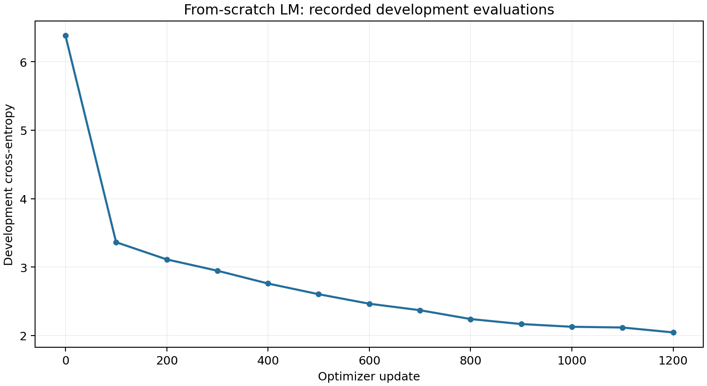
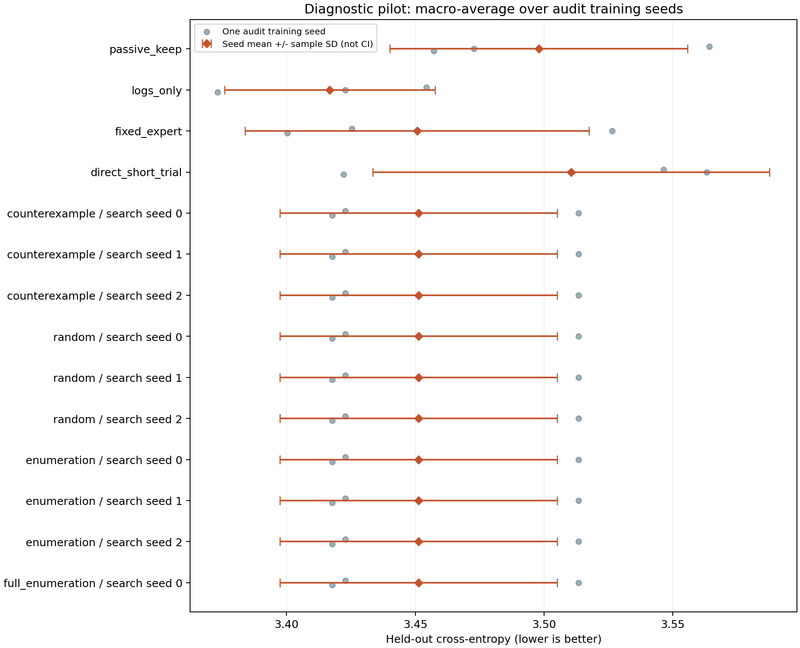

# BranchLab 实测发布报告

运行状态：**completed**。预设 gate：**NOGO**。

判定原因：The counterexample program does not beat every prespecified comparator in every audit seed, or a branch failed. No diagnostic advantage or RSI claim is admitted.

实验范围：Controlled training perturbations; finite diagnostic grammar; exploratory pilot

本报告从随附 JSON 生成；未提供的指标明确留空。软件测试通过、一次小模型训练成功和研究假设成立是不同结论。

## 从零模型训练

| 项目 | 实测记录 |
| --- | --- |
| 参数量 | 19,140,096 |
| 训练 token | 1,228,800 |
| 初始开发集交叉熵 | 6.381173 |
| 最终开发集交叉熵 | 2.045100 |
| 训练调用总耗时 / s | 406.510 |
| 设备 | mps:0 |
| PyTorch | 2.8.0 |

这里报告开发集指标，不能改写为最终测试集成绩。训练样本规模和完整配置见 [run.json](run.json)。



曲线只连接 history.json 中实际记录的开发集评估点，不插入额外测量。

## KV cache 测量

| 项目 | 实测记录 |
| --- | --- |
| Cached decode / tokens·s⁻¹ | 155.546 |
| Uncached decode / tokens·s⁻¹ | 58.720 |
| Decode 倍率 | 2.649 |
| Prefill / s | 0.013643 |
| Logits 最大绝对差 | 0.000013351 |
| 设备 / 精度 | cpu / torch.float32 |
| Batch / prompt / decode长度 | 1 / 64 / 32 |
| 重复次数 | 5 |

测速使用相同固定 token 续写、预热和设备同步，prefill 与 decode 分开计时。倍率只适用于该模型和配置，不计作训练或 RSI 收益。

可比的逐次 allocator 峰值内存：未提供。原因：No comparable per-trial peak allocator counter exposed for CPU/MPS。

## 训练诊断 pilot

Episode 数：24；audit seeds：[5, 6, 7]。

| 方法 / 搜索种子 | 已选探针 | 固定预算测试 loss | 固定期限开发 regret | 平均诊断成本 | 平均修复步数 | 搜索揭示 cells | 搜索重放成本 |
| --- | --- | ---: | ---: | ---: | ---: | ---: | ---: |
| passive_keep | 无 | 3.497974 | 0.106540 | 0.00 | 52.00 | 0 | 0.00 |
| logs_only | 无 | 3.416762 | 0.002045 | 0.00 | 52.00 | 0 | 0.00 |
| fixed_expert | lr_half:4:loss_delta | 3.450665 | 0.002045 | 28.00 | 43.00 | 9 | 252.00 |
| direct_short_trial | 无 | 3.510543 | 0.038928 | 42.00 | 38.00 | 0 | 0.00 |
| counterexample / search seed 0 | lr_half:2:grad_alignment | 3.451266 | 0.002045 | 16.00 | 47.00 | 150 | 4560.00 |
| counterexample / search seed 1 | lr_half:2:grad_alignment | 3.451266 | 0.002045 | 16.00 | 47.00 | 150 | 4560.00 |
| counterexample / search seed 2 | lr_half:2:grad_alignment | 3.451266 | 0.002045 | 16.00 | 47.00 | 150 | 4560.00 |
| random / search seed 0 | lr_half:2:grad_alignment | 3.451266 | 0.002045 | 16.00 | 47.00 | 150 | 4380.00 |
| random / search seed 1 | lr_half:2:loss_delta | 3.451266 | 0.002045 | 16.00 | 47.00 | 150 | 4740.00 |
| random / search seed 2 | lr_half:2:grad_alignment | 3.451266 | 0.002045 | 16.00 | 47.00 | 150 | 5280.00 |
| enumeration / search seed 0 | lr_half:2:grad_alignment | 3.451266 | 0.002045 | 16.00 | 47.00 | 150 | 4560.00 |
| enumeration / search seed 1 | lr_half:2:grad_alignment | 3.451266 | 0.002045 | 16.00 | 47.00 | 150 | 4560.00 |
| enumeration / search seed 2 | lr_half:2:grad_alignment | 3.451266 | 0.002045 | 16.00 | 47.00 | 150 | 4560.00 |
| full_enumeration / search seed 0 | lr_half:2:grad_alignment | 3.451266 | 0.002045 | 16.00 | 47.00 | 270 | 8640.00 |

表格使用 summary.json 的原始汇总，两个损失指标对应不同测量：

- regret 使用固定 24 次更新后的开发文本 loss，以受限动作菜单中的最低 loss 为参照；这些状态来自 holdout 训练 seeds。它不是最终测试文本 regret，也未扣除诊断预算。
- 测试 loss 使用每个状态 160 个 forward-equivalent 代理单位的预算，先扣除诊断成本，再分配修复更新步数。它才是这次 gate 比较的结果指标。

同名方法的不同 search seed 单独列出。counterexample/enumeration 当前为确定性排序，更换 search seed 不产生新算法重复。多个 episode 属于同一训练 seed 时也不是独立重复。完整动作、剩余预算与逐 seed 指标见 [summary.json](summary.json)。

预算说明：counterexample、random 和 enumeration 的搜索上限为 150 个唯一 episode/probe cells；full_enumeration 使用 100,000-cell 上限来提供完整候选参考，**不是同搜索预算对照**。实际揭示量按各行原样报告，不把上限当消耗。

每次分支评估只用一个固定开发批次和一个固定测试批次，各 256 tokens。这个很小的评估窗口限制结果稳定性与外推范围。



图中每项为该方法的 audit-seed 宏平均；点代表一个训练 seed，误差棒为 seed 间样本标准差，并非置信区间。只有一个 seed 时不画误差棒。不同搜索种子不合并为额外训练重复。

Gate 比较明细（按输入保留）：

```json
[
  {
    "baseline": "passive_keep",
    "per_seed": [
      {
        "seed": 5,
        "counterexample_minus_baseline": -0.1414347489674883
      },
      {
        "seed": 6,
        "counterexample_minus_baseline": 0.040652592976887725
      },
      {
        "seed": 7,
        "counterexample_minus_baseline": -0.039339860280354966
      }
    ],
    "all_audit_seeds_lower": false
  },
  {
    "baseline": "logs_only",
    "per_seed": [
      {
        "seed": 5,
        "counterexample_minus_baseline": -0.0316310723622637
      },
      {
        "seed": 6,
        "counterexample_minus_baseline": 0.09058221181233694
      },
      {
        "seed": 7,
        "counterexample_minus_baseline": 0.044560909271240234
      }
    ],
    "all_audit_seeds_lower": false
  },
  {
    "baseline": "fixed_expert",
    "per_seed": [
      {
        "seed": 5,
        "counterexample_minus_baseline": -0.002581040064493667
      },
      {
        "seed": 6,
        "counterexample_minus_baseline": -0.013083140055338838
      },
      {
        "seed": 7,
        "counterexample_minus_baseline": 0.017466306686401367
      }
    ],
    "all_audit_seeds_lower": false
  },
  {
    "baseline": "direct_short_trial",
    "per_seed": [
      {
        "seed": 5,
        "counterexample_minus_baseline": -0.12369108200073242
      },
      {
        "seed": 6,
        "counterexample_minus_baseline": -0.04981597264607762
      },
      {
        "seed": 7,
        "counterexample_minus_baseline": -0.004323164621989228
      }
    ],
    "all_audit_seeds_lower": true
  },
  {
    "baseline": "random",
    "per_seed": [
      {
        "seed": 5,
        "counterexample_minus_baseline": 0.0
      },
      {
        "seed": 6,
        "counterexample_minus_baseline": 0.0
      },
      {
        "seed": 7,
        "counterexample_minus_baseline": 0.0
      }
    ],
    "all_audit_seeds_lower": false
  },
  {
    "baseline": "enumeration",
    "per_seed": [
      {
        "seed": 5,
        "counterexample_minus_baseline": 0.0
      },
      {
        "seed": 6,
        "counterexample_minus_baseline": 0.0
      },
      {
        "seed": 7,
        "counterexample_minus_baseline": 0.0
      }
    ],
    "all_audit_seeds_lower": false
  }
]
```

## 成本与失败记录

| 实际全表采集记录 | 数值 |
| --- | ---: |
| 总耗时 / s | 132.794 |
| Training updates | 4,704 |
| Evaluation batches | 7,520 |
| 训练 token | 1,204,224 |

全表采集是已实际发生的计算。搜索重放成本是按查询账本模拟的可见信息开销；测试期的诊断开销另计。失败/丢弃分支也属于真实采集成本。读出共享分支不代表已实现对应的端到端速度节省。

如使用 optimizer-update 或 forward-equivalent 预算，它是报告中明确限定的计算代理量，不能替代完整生命周期或硬件耗时比较。

输入失败清单为空；这只描述该清单，不保证覆盖尚未记录的失败。

运行保存的限制：

- One model size and one small repartitioned corpus; 3 held-out seeds
- One fixed 256-token dev batch and one fixed 256-token test batch per branch evaluation
- Synthetic perturbations; not real Marin training failures
- Validation regret selects programs; cost-adjusted test loss is a separate outcome
- All repair labels and probe tables are physically precomputed and charged in collection
- Fixed finite grammar and synthesizer; recursive self-improvement is not tested

## 可支持的结论

本次 gate 状态为 **NOGO**，原因是：The counterexample program does not beat every prespecified comparator in every audit seed, or a branch failed. No diagnostic advantage or RSI claim is admitted.

PASS_EXPLORATORY 仅表示预设 pilot gate 的探索性通过；NOGO 表示未通过该 gate，均不自动构成显著性、SOTA、跨规模复现或新颖性证明。

此实现继承已选诊断程序，合成器规则本身保持固定。没有完成旧/新改进器产生后代的受控比较，因此不宣称验证递归自我改进或 full RSI。Marin 公开资料提供问题动机，本地分叉提供本实验的实际干预证据。

输入 JSON 和生成文件的 SHA-256 见 [report_manifest.json](report_manifest.json)。
